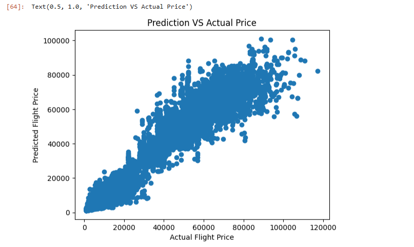
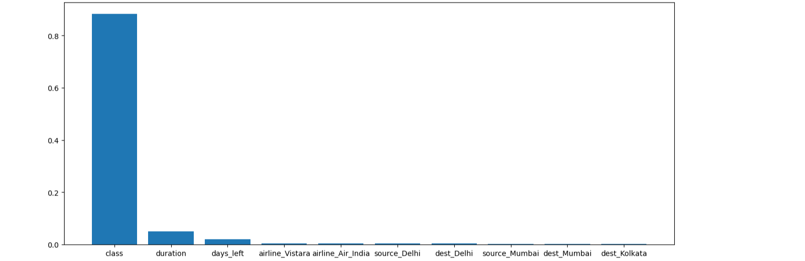

# ✈️ Flight Price Prediction using Machine Learning

## 📖 Overview
This project predicts **flight ticket prices** based on several flight-related features such as airline, source and destination cities, departure and arrival times, number of stops, travel class, and how many days are left before the flight.

It uses a **Random Forest Regressor** and applies **GridSearchCV** and **RandomizedSearchCV** for hyperparameter tuning to find the best-performing model.

---

## 🧰 Tech Stack
- **Language:** Python  
- **Libraries:** pandas, numpy, scikit-learn, matplotlib, scipy  
- **Environment:** Jupyter Notebook  

---

## 🗂️ Dataset
The dataset used is `Clean_Dataset.csv`.  
It contains flight details and corresponding prices.  

**Columns include:**
- `airline`
- `source_city`
- `destination_city`
- `departure_time`
- `arrival_time`
- `stops`
- `class`
- `duration`
- `days_left`
- `price`

---

## ⚙️ Project Workflow
1. **Data Preprocessing**
   - Removed irrelevant columns (`Unnamed: 0`, `flight`)
   - Encoded categorical features using `pd.get_dummies` and label encoding
   - Converted data types for model compatibility

2. **Model Building**
   - Used `RandomForestRegressor` for regression
   - Split data into training and test sets (80/20)

3. **Model Evaluation**
   - Evaluated performance using:
     - R² Score  
     - MAE (Mean Absolute Error)  
     - MSE (Mean Squared Error)  
     - RMSE (Root Mean Squared Error)
   - Visualized Actual vs Predicted Prices

4. **Hyperparameter Tuning**
   - Used both **GridSearchCV** and **RandomizedSearchCV** from `sklearn.model_selection`
   - Found optimal hyperparameters for improved accuracy

---

## 📊 Results
| Metric | Description |
|---------|--------------|
| **R²** | 0.9788014045814392 |
| **MAE** | 1452.0485410706058 |
| **MSE** | 11003995.919219095 |
| **RMSE** | 3317.2271431451745 |

---

## 📈 Visualizations
### 🔹 Prediction vs Actual Price


### 🔹 Feature Importance


---

## ⚡ Setup Instructions

Follow these steps to run the project locally:

### 1️⃣ Clone the repository
```bash
git clone https://github.com/mchlrd/Flight-Price-Prediction-ML.git
cd flight-price-prediction
